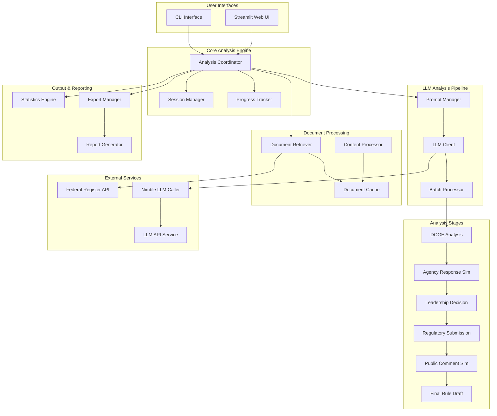

# Design Document

## Overview

The CFR Document Analyzer extends the existing CFR Agency Document Counter to create a comprehensive document analysis system. The system retrieves CFR documents by agency, applies configurable LLM prompts for content analysis, and provides aggregated insights and statistics. The design leverages the existing infrastructure while adding document retrieval, content analysis, and multi-stage regulatory simulation capabilities.

The system supports multiple analysis workflows including DOGE emulation, agency response simulation, leadership decision modeling, regulatory submission generation, public comment simulation, and final rule drafting. It provides both CLI and web-based interfaces for flexible usage.

## Architecture

### High-Level Architecture



### Component Architecture

The system follows a modular architecture with clear separation of concerns:

1. **Interface Layer**: CLI and web interfaces for user interaction
2. **Coordination Layer**: Orchestrates analysis workflows and manages sessions
3. **Processing Layer**: Handles document retrieval, content processing, and caching
4. **Analysis Layer**: Manages LLM interactions and analysis stages
5. **Output Layer**: Generates statistics, reports, and exports

## Components and Interfaces

### Core Components

#### Analysis Coordinator
- **Purpose**: Orchestrates the entire analysis workflow
- **Responsibilities**:
  - Manages analysis session lifecycle
  - Coordinates between different processing stages
  - Handles error recovery and resumption
  - Tracks overall progress and resource usage
- **Interface**:
  ```python
  class AnalysisCoordinator:
      def start_analysis(self, config: AnalysisConfig) -> AnalysisSession
      def resume_analysis(self, session_id: str) -> AnalysisSession
      def get_session_status(self, session_id: str) -> SessionStatus
      def cancel_analysis(self, session_id: str) -> bool
  ```

#### Document Retriever
- **Purpose**: Retrieves CFR documents from Federal Register API
- **Responsibilities**:
  - Fetches document metadata and content
  - Handles API rate limiting and retries
  - Caches documents for reuse
  - Extracts full text content
- **Interface**:
  ```python
  class DocumentRetriever:
      def get_agency_documents(self, agency_slug: str, limit: int = None) -> List[Document]
      def get_document_content(self, document_id: str) -> DocumentContent
      def cache_document(self, document: Document) -> None
      def get_cached_document(self, document_id: str) -> Optional[Document]
  ```

#### LLM Analysis Engine
- **Purpose**: Manages LLM interactions for document analysis
- **Responsibilities**:
  - Applies prompts to document content
  - Manages batch processing for efficiency
  - Handles API failures and retries
  - Tracks token usage and costs
- **Interface**:
  ```python
  class LLMAnalysisEngine:
      def analyze_document(self, document: Document, prompts: List[Prompt]) -> AnalysisResult
      def batch_analyze(self, documents: List[Document], prompts: List[Prompt]) -> List[AnalysisResult]
      def get_usage_stats(self) -> UsageStats
  ```

#### Prompt Manager
- **Purpose**: Manages analysis prompts and prompt packages
- **Responsibilities**:
  - Loads and validates prompt configurations
  - Provides default prompt packages
  - Supports custom prompt creation
  - Manages prompt versioning
- **Interface**:
  ```python
  class PromptManager:
      def load_prompt_package(self, package_name: str) -> PromptPackage
      def create_custom_prompts(self, prompts: List[str]) -> PromptPackage
      def validate_prompts(self, prompts: List[str]) -> ValidationResult
      def get_available_packages(self) -> List[str]
  ```

#### Session Manager
- **Purpose**: Manages analysis session state and persistence
- **Responsibilities**:
  - Creates and tracks analysis sessions
  - Persists session state for resumption
  - Manages session cleanup and archival
  - Provides session recovery capabilities
- **Interface**:
  ```python
  class SessionManager:
      def create_session(self, config: AnalysisConfig) -> str
      def save_session_state(self, session_id: str, state: SessionState) -> None
      def load_session_state(self, session_id: str) -> SessionState
      def list_sessions(self) -> List[SessionInfo]
  ```

### Analysis Stage Components

#### DOGE Analysis Stage
- **Purpose**: Implements DOGE methodology analysis
- **Responsibilities**:
  - Categorizes regulations (SR/NSR/NRAN)
  - Identifies statutory provisions
  - Evaluates reform potential
  - Generates DOGE-style recommendations
- **Interface**:
  ```python
  class DOGEAnalysisStage:
      def analyze_regulation(self, document: Document) -> DOGEAnalysis
      def categorize_regulation(self, content: str) -> RegulationCategory
      def identify_statutory_basis(self, content: str) -> List[StatutoryReference]
  ```

#### Agency Response Simulator
- **Purpose**: Simulates agency responses to analysis recommendations
- **Responsibilities**:
  - Generates realistic agency feedback
  - Supports multiple agency perspectives
  - Provides detailed rationale for positions
  - Models agency resistance and alignment
- **Interface**:
  ```python
  class AgencyResponseSimulator:
      def simulate_response(self, analysis: DOGEAnalysis, perspective: AgencyPerspective) -> AgencyResponse
      def generate_feedback(self, recommendations: List[Recommendation]) -> List[AgencyFeedback]
  ```

#### Leadership Decision Simulator
- **Purpose**: Simulates agency leadership decisions on recommendations
- **Responsibilities**:
  - Models leadership decision-making
  - Supports overrule, compromise, alignment scenarios
  - Updates recommendations based on decisions
  - Provides decision justifications
- **Interface**:
  ```python
  class LeadershipDecisionSimulator:
      def make_decisions(self, agency_feedback: List[AgencyFeedback]) -> List[LeadershipDecision]
      def update_recommendations(self, decisions: List[LeadershipDecision]) -> List[UpdatedRecommendation]
  ```

### Output Components

#### Statistics Engine
- **Purpose**: Generates comprehensive analysis statistics
- **Responsibilities**:
  - Calculates aggregate metrics across documents
  - Identifies patterns and trends
  - Generates comparative statistics
  - Provides cost and usage analytics
- **Interface**:
  ```python
  class StatisticsEngine:
      def calculate_aggregate_stats(self, results: List[AnalysisResult]) -> AggregateStats
      def identify_patterns(self, results: List[AnalysisResult]) -> List[Pattern]
      def generate_cost_analysis(self, usage_stats: UsageStats) -> CostAnalysis
  ```

#### Export Manager
- **Purpose**: Handles data export in multiple formats
- **Responsibilities**:
  - Exports results to JSON, CSV, HTML formats
  - Generates human-readable reports
  - Creates visualizations and charts
  - Manages file organization and naming
- **Interface**:
  ```python
  class ExportManager:
      def export_results(self, results: AnalysisResults, format: ExportFormat) -> str
      def generate_report(self, results: AnalysisResults, template: str) -> str
      def create_visualizations(self, stats: AggregateStats) -> List[Visualization]
  ```

## Data Models

### Core Data Models

```python
@dataclass
class Document:
    """Represents a CFR document with metadata and content."""
    document_id: str
    agency_slug: str
    title: str
    publication_date: datetime
    cfr_citation: str
    content: Optional[str] = None
    metadata: Dict[str, Any] = field(default_factory=dict)

@dataclass
class AnalysisConfig:
    """Configuration for an analysis session."""
    agencies: List[str]
    prompt_package: str
    custom_prompts: Optional[List[str]] = None
    document_limit: Optional[int] = None
    stages_to_run: List[str] = field(default_factory=lambda: ['doge'])
    parallel_processing: bool = True
    max_workers: int = 4
    output_formats: List[str] = field(default_factory=lambda: ['json', 'csv'])

@dataclass
class AnalysisResult:
    """Results from analyzing a single document."""
    document_id: str
    prompt_responses: Dict[str, str]
    analysis_metadata: Dict[str, Any]
    processing_time: float
    token_usage: int
    success: bool
    error_message: Optional[str] = None

@dataclass
class DOGEAnalysis:
    """DOGE-specific analysis results."""
    category: RegulationCategory  # SR, NSR, NRAN
    statutory_references: List[StatutoryReference]
    reform_recommendations: List[Recommendation]
    justification: str
    compliance_assessment: ComplianceAssessment

@dataclass
class AgencyResponse:
    """Simulated agency response to analysis."""
    agency_slug: str
    perspective_type: AgencyPerspective
    position: ResponsePosition  # ALIGNED, RESISTANT, PARTIAL
    feedback: List[AgencyFeedback]
    rationale: str
    proposed_modifications: List[str]

@dataclass
class SessionState:
    """Persistent state for analysis sessions."""
    session_id: str
    config: AnalysisConfig
    current_stage: str
    processed_documents: List[str]
    results: List[AnalysisResult]
    created_at: datetime
    last_updated: datetime
    status: SessionStatus
```

### Enumeration Types

```python
class RegulationCategory(Enum):
    STATUTORILY_REQUIRED = "SR"
    NOT_STATUTORILY_REQUIRED = "NSR"
    NOT_REQUIRED_AGENCY_NEEDS = "NRAN"

class AgencyPerspective(Enum):
    FULLY_ALIGNED = "fully_aligned"
    FULLY_RESISTANT = "fully_resistant"
    PARTLY_RESISTANT = "partly_resistant"
    BIPARTISAN_EXPERT = "bipartisan_expert"

class SessionStatus(Enum):
    CREATED = "created"
    RUNNING = "running"
    PAUSED = "paused"
    COMPLETED = "completed"
    FAILED = "failed"
    CANCELLED = "cancelled"

class ExportFormat(Enum):
    JSON = "json"
    CSV = "csv"
    HTML = "html"
    PDF = "pdf"
```

## Error Handling

### Error Categories

1. **API Errors**: Federal Register API failures, rate limiting, timeouts
2. **LLM Errors**: Model API failures, token limits, content policy violations
3. **Processing Errors**: Document parsing failures, content extraction issues
4. **Session Errors**: State corruption, resumption failures, resource conflicts
5. **Export Errors**: File system issues, format conversion failures

### Error Handling Strategy

```python
class AnalysisError(Exception):
    """Base exception for analysis errors."""
    def __init__(self, message: str, error_code: str, recoverable: bool = True):
        self.message = message
        self.error_code = error_code
        self.recoverable = recoverable
        super().__init__(message)

class ErrorHandler:
    """Centralized error handling and recovery."""
    
    def handle_api_error(self, error: Exception, context: Dict) -> ErrorResponse:
        """Handle API-related errors with retry logic."""
        
    def handle_llm_error(self, error: Exception, context: Dict) -> ErrorResponse:
        """Handle LLM API errors with fallback strategies."""
        
    def handle_processing_error(self, error: Exception, context: Dict) -> ErrorResponse:
        """Handle document processing errors."""
        
    def should_retry(self, error: AnalysisError) -> bool:
        """Determine if an error should trigger a retry."""
        
    def get_recovery_strategy(self, error: AnalysisError) -> RecoveryStrategy:
        """Get appropriate recovery strategy for an error."""
```

### Recovery Mechanisms

1. **Automatic Retry**: Exponential backoff for transient failures
2. **Graceful Degradation**: Continue processing with partial results
3. **Session Persistence**: Save progress before critical operations
4. **Fallback Strategies**: Alternative processing methods when primary fails
5. **User Notification**: Clear error messages with suggested actions

## Testing Strategy

### Unit Testing

- **Component Testing**: Test individual components in isolation
- **Mock Dependencies**: Mock external APIs and services
- **Edge Case Coverage**: Test error conditions and boundary cases
- **Data Validation**: Verify data model constraints and validation

### Integration Testing

- **API Integration**: Test Federal Register API interactions
- **LLM Integration**: Test nimble-llm-caller integration
- **End-to-End Workflows**: Test complete analysis pipelines
- **Session Management**: Test session persistence and recovery

### Performance Testing

- **Load Testing**: Test with large document sets
- **Concurrency Testing**: Verify parallel processing capabilities
- **Memory Usage**: Monitor memory consumption with large datasets
- **API Rate Limiting**: Verify rate limiting compliance

### Test Data Management

```python
class TestDataManager:
    """Manages test data for various testing scenarios."""
    
    def create_sample_documents(self, count: int) -> List[Document]:
        """Create sample documents for testing."""
        
    def create_mock_api_responses(self) -> Dict[str, Any]:
        """Create mock API responses for testing."""
        
    def create_test_session(self, config: AnalysisConfig) -> SessionState:
        """Create test session state."""
```

### Testing Configuration

- **Pytest Framework**: Primary testing framework
- **Coverage Reporting**: Minimum 90% code coverage
- **Continuous Integration**: Automated testing on code changes
- **Test Environment**: Isolated test environment with mock services

### Key Functionality Preserved from regulatory_reform

The design incorporates essential functionality from the existing regulatory_reform system:

1. **LLM Integration**: Uses litellm with json_repair for robust LLM API calls
2. **Prompt Strategy Management**: JSON-based prompt configuration system
3. **Meta-Analysis**: Secondary LLM analysis to synthesize multiple prompt responses
4. **Progress Tracking**: Real-time progress callbacks for both CLI and web interfaces
5. **Database Persistence**: SQLite-based storage for regulations and analysis results
6. **Streamlit Web Interface**: Multi-page web application with authentication
7. **Federal Register XML Parsing**: Robust XML content extraction from Federal Register
8. **Agency Management**: Dynamic agency list fetching and filtering
9. **Batch Processing**: Efficient document chunking and processing
10. **Error Recovery**: Graceful handling of API failures and partial results

### Proof of Concept Focus

The initial implementation will focus on a proof of concept with:
- Single agency with small rule set for testing
- Core DOGE analysis functionality
- Basic web interface for configuration and results
- Essential error handling and progress tracking
- Simple export capabilities (JSON/CSV)

## Implementation Phases

### Phase 1: Core Infrastructure (Proof of Concept)
- Extend existing CFR counter with document content retrieval
- Integrate litellm-based LLM client with nimble-llm-caller fallback
- Implement basic prompt management and DOGE analysis
- Create SQLite database for document and analysis storage
- Add progress tracking and basic error handling

### Phase 2: Web Interface and Analysis Pipeline
- Implement Streamlit web interface with agency selection
- Add prompt strategy management (JSON-based configuration)
- Create meta-analysis functionality for synthesizing results
- Implement batch processing with configurable limits
- Add export functionality (JSON, CSV formats)

### Phase 3: Advanced Analysis Stages
- Add agency response simulation
- Implement leadership decision modeling
- Create regulatory submission generation
- Add public comment simulation capabilities
- Enhance statistics and reporting engine

### Phase 4: Production Features
- Add comprehensive monitoring and logging
- Implement advanced error recovery and session resumption
- Add performance optimization and parallel processing
- Create deployment and scaling capabilities
- Add authentication and user management

This design provides a robust, extensible foundation for the CFR Document Analyzer while leveraging proven patterns from the regulatory_reform codebase and focusing on a practical proof of concept approach.