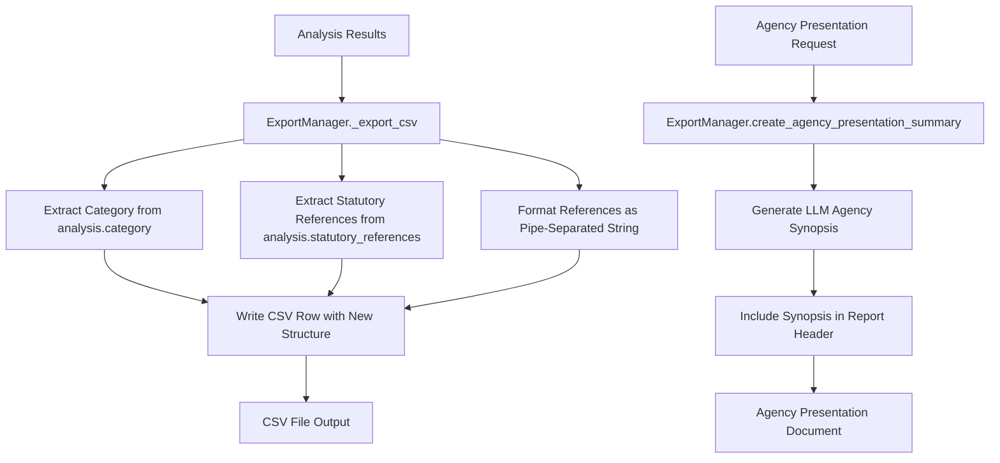

# Design Document

## Overview

This design restructures the CSV export functionality in the CFR Document Analyzer to improve data accessibility and usability. The changes extract key information from JSON structures into dedicated columns, remove preview text, and add an LLM-generated agency synopsis to reports. The design maintains backward compatibility while providing a cleaner, more structured CSV format.

## Architecture

The changes primarily affect the `ExportManager` class in `cfr_document_analyzer/export_manager.py`. The restructuring involves:

1. **CSV Column Restructuring**: Modifying the `_export_csv` method to change column order and content
2. **Data Extraction**: Enhancing data processing to extract category and statutory references from analysis objects
3. **Agency Synopsis Integration**: Adding LLM calls to generate agency overviews for presentation reports
4. **Format Consistency**: Ensuring all CSV export paths use the new structure

## Components and Interfaces

### Modified Components

#### ExportManager Class
- **Location**: `cfr_document_analyzer/export_manager.py`
- **Changes**: 
  - Update `_export_csv()` method for new column structure
  - Modify `create_agency_presentation_summary()` to include LLM-generated synopsis
  - Update header definitions and data row generation

#### CSV Export Structure
**Current Structure**:
```
Document Number | Title | Agency | Publication Date | Content Length | Category | Statutory References Count | Reform Recommendations Count | Analysis Success | Processing Time (s) | Justification Preview
```

**New Structure**:
```
Document Number | Title | Agency | Publication Date | Content Length | Category | Statutory References Count | Statutory References | Reform Recommendations Count | Analysis Success | Processing Time (s)
```

### Data Flow



## Data Models

### CSV Row Structure

```python
@dataclass
class CSVRowData:
    """Represents a single CSV row with restructured columns."""
    document_number: str
    title: str
    agency: str
    publication_date: str
    content_length: int
    category: str  # Extracted from analysis.category
    statutory_references_count: int
    statutory_references: str  # Pipe-separated list
    reform_recommendations_count: int
    analysis_success: str  # "Yes" or "No"
    processing_time: str  # Formatted as "X.XX"
```

### Agency Synopsis Structure

```python
@dataclass
class AgencySynopsis:
    """LLM-generated agency overview for reports."""
    agency_name: str
    synopsis_text: str  # 100-word overview
    generation_success: bool
    error_message: Optional[str] = None
```

## Implementation Details

### CSV Column Restructuring

#### Header Changes
```python
# Old headers
headers = [
    'Document Number', 'Title', 'Agency', 'Publication Date', 'Content Length',
    'Category', 'Statutory References Count', 'Reform Recommendations Count',
    'Analysis Success', 'Processing Time (s)', 'Justification Preview'
]

# New headers
headers = [
    'Document Number', 'Title', 'Agency', 'Publication Date', 'Content Length',
    'Category', 'Statutory References Count', 'Statutory References',
    'Reform Recommendations Count', 'Analysis Success', 'Processing Time (s)'
]
```

#### Data Extraction Logic
```python
def extract_csv_data(result: Dict[str, Any]) -> CSVRowData:
    """Extract and format data for CSV export."""
    analysis = result['analysis']
    
    # Extract category directly from analysis
    category = analysis.get('category', 'UNKNOWN')
    if hasattr(category, 'value'):  # Handle enum
        category = category.value
    
    # Format statutory references as pipe-separated string
    statutory_refs = analysis.get('statutory_references', [])
    statutory_refs_str = '|'.join(statutory_refs) if statutory_refs else ''
    
    return CSVRowData(
        document_number=result['document_number'],
        title=result['title'],
        agency=extract_agency_name(result['agency_slug']),
        publication_date=result.get('publication_date', ''),
        content_length=result.get('content_length', 0),
        category=category,
        statutory_references_count=len(statutory_refs),
        statutory_references=statutory_refs_str,
        reform_recommendations_count=len(analysis.get('reform_recommendations', [])),
        analysis_success='Yes' if analysis.get('success') else 'No',
        processing_time=f"{analysis.get('processing_time', 0):.2f}"
    )
```

### Agency Synopsis Integration

#### LLM Call Implementation
```python
async def generate_agency_synopsis(self, agency_name: str) -> AgencySynopsis:
    """Generate 100-word agency synopsis using LLM."""
    prompt = f"""
    Provide a 100-word synopsis of {agency_name} including:
    1. Statutory authority and legal foundation
    2. Brief history and establishment
    3. Informal description of its role and mission
    4. Key issues and challenges in today's Washington political environment
    
    Format as a single paragraph, exactly 100 words.
    """
    
    try:
        # Use existing LLM client infrastructure
        response = await self.llm_client.analyze_document(
            document_content=prompt,
            document_id=f"agency_synopsis_{agency_name}",
            prompt_strategy="agency_overview"
        )
        
        return AgencySynopsis(
            agency_name=agency_name,
            synopsis_text=response.justification,
            generation_success=response.success
        )
    except Exception as e:
        return AgencySynopsis(
            agency_name=agency_name,
            synopsis_text="",
            generation_success=False,
            error_message=str(e)
        )
```

#### Report Integration
```python
def create_agency_presentation_summary(self, results: List[Dict[str, Any]], session_id: str) -> str:
    """Create enhanced agency presentation with LLM synopsis."""
    # Generate agency synopsis
    agency_name = summary.get('agency_name', 'Unknown Agency')
    synopsis = await self.generate_agency_synopsis(agency_name)
    
    # Include synopsis in report header
    content = f"""# CFR Document Analysis Summary
## {agency_name}

### Agency Overview
{synopsis.synopsis_text if synopsis.generation_success else "Agency overview could not be generated at this time."}

**Analysis Date:** {datetime.now().strftime('%Y-%m-%d')}  
**Session ID:** {session_id}  
**Documents Analyzed:** {summary.get('total_documents', 0)}
"""
    # ... rest of report generation
```

## Error Handling

### CSV Export Errors
- **Missing Category**: Default to "UNKNOWN"
- **Missing Statutory References**: Use empty string
- **Invalid Data Types**: Convert to string representation
- **Encoding Issues**: Use UTF-8 with error handling

### Agency Synopsis Errors
- **LLM Call Failure**: Include placeholder text in report
- **Timeout**: Provide fallback message
- **Rate Limiting**: Queue request or skip synopsis
- **Invalid Response**: Use error message in report

## Testing Strategy

### Unit Tests
- Test CSV column restructuring with various data combinations
- Test statutory references formatting (empty, single, multiple)
- Test category extraction from different analysis result formats
- Test agency synopsis generation and error handling

### Integration Tests
- Test complete CSV export workflow with new structure
- Test agency presentation generation with LLM synopsis
- Test backward compatibility with existing analysis results
- Test error scenarios and fallback behavior

### Data Validation Tests
- Verify CSV format compatibility with spreadsheet applications
- Test pipe-separated statutory references parsing
- Validate agency synopsis word count and content quality
- Test Unicode and special character handling

## Performance Considerations

### CSV Export Performance
- **Memory Usage**: Process results in batches for large datasets
- **File I/O**: Use buffered writing for large CSV files
- **Data Processing**: Cache extracted data to avoid repeated processing

### LLM Synopsis Performance
- **API Calls**: Implement caching for repeated agency requests
- **Timeout Handling**: Set reasonable timeouts for synopsis generation
- **Rate Limiting**: Respect LLM API rate limits
- **Async Processing**: Use async/await for non-blocking synopsis generation

## Migration Strategy

### Backward Compatibility
- Maintain existing export function signatures
- Preserve all existing data fields (except Justification Preview)
- Ensure existing scripts continue to work with new CSV structure

### Documentation Updates
- Update README with new CSV format specification
- Provide migration guide for users of old format
- Include examples of new CSV structure
- Document agency synopsis feature and requirements

### Rollout Plan
1. **Phase 1**: Implement CSV restructuring with feature flag
2. **Phase 2**: Add agency synopsis generation
3. **Phase 3**: Update documentation and examples
4. **Phase 4**: Enable new format by default
5. **Phase 5**: Remove old format support after transition period